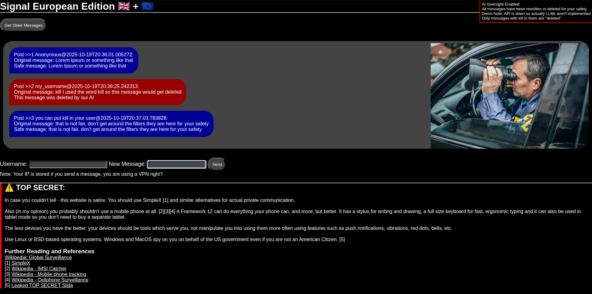

# Signal European Edition
A combined effort between the EU 🇪🇺 and UK 🇬🇧 to make the internet safer.

## Demo  

[Interactive Demo](http://46.101.90.169:5005/)  


## Features  
- Allow clients to send messages, while logging IPs and timestamp when storing those messages 
- Display latest 20 messages client side including timestamp and post id and username  
- Button to see older messages  
- Two AI placeholder functions which doesn't do anything  
- Live updates when new messages are sent  
- Load older messages
- Usernames (the same one can be used by everyone)  
- Reminder div so you don't forget the AI is(n't) watching
- Warning message and further reading with references  

### Possible Updates:  
- Improve CSS  
- Refactor repeated code
- AI filter 1 returns 0 or 1 whether the Message will be sent or deleted (original message is still shown along with the fact it would've been filtered)  
- AI (LLM) filter 2 if message is displayed, rewrite it first anyways to make it safer (original message is still shown so you can see the changes it would've made)  
- Image embedding (uploaded to other servers not the chat server)
- Themes
- Message edit and delete
- Moderation tools


## Self hosting instructions (intended usage method)
```text
git clone https://github.com/shania-codes/eurosignal  
cd eurosignal  
python3 -m venv venv  
source venv/bin/activate  
pip install flask flask_socketio  
flask run  
https://127.0.0.1:5000  
```

Tested working 19/10/25: [Interactive Demo](http://46.101.90.169:5005/)